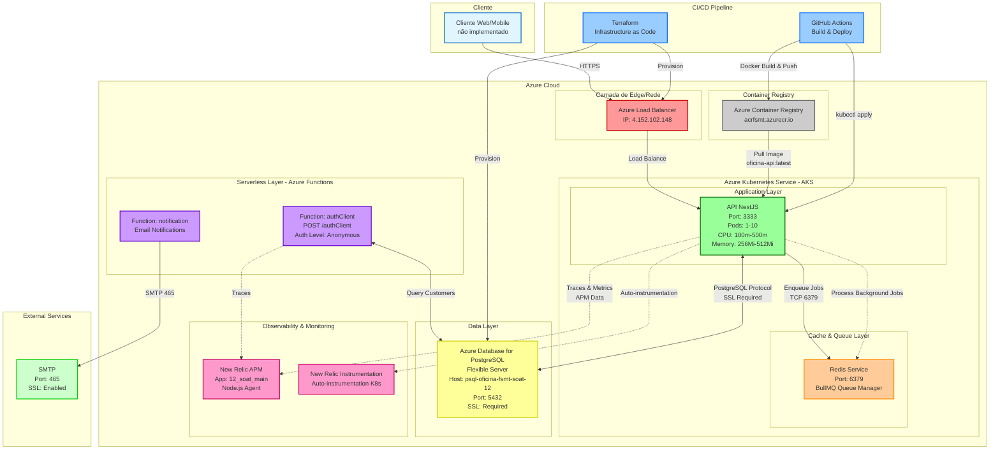
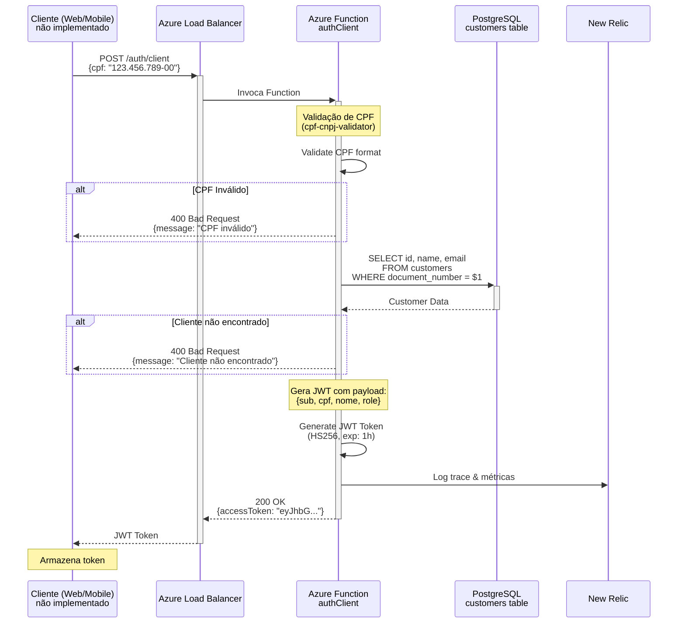
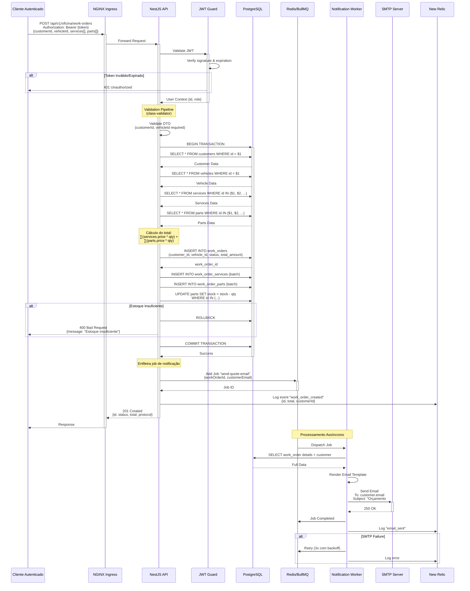
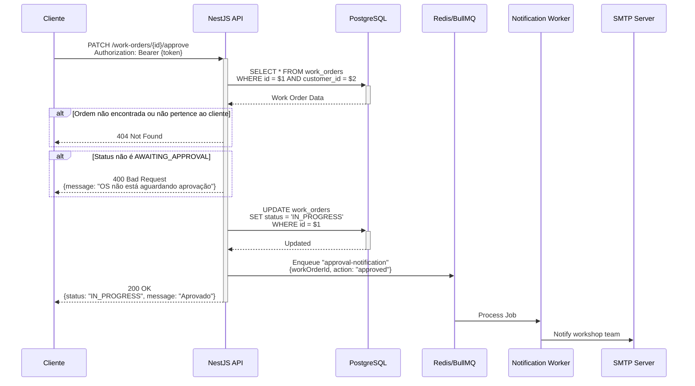
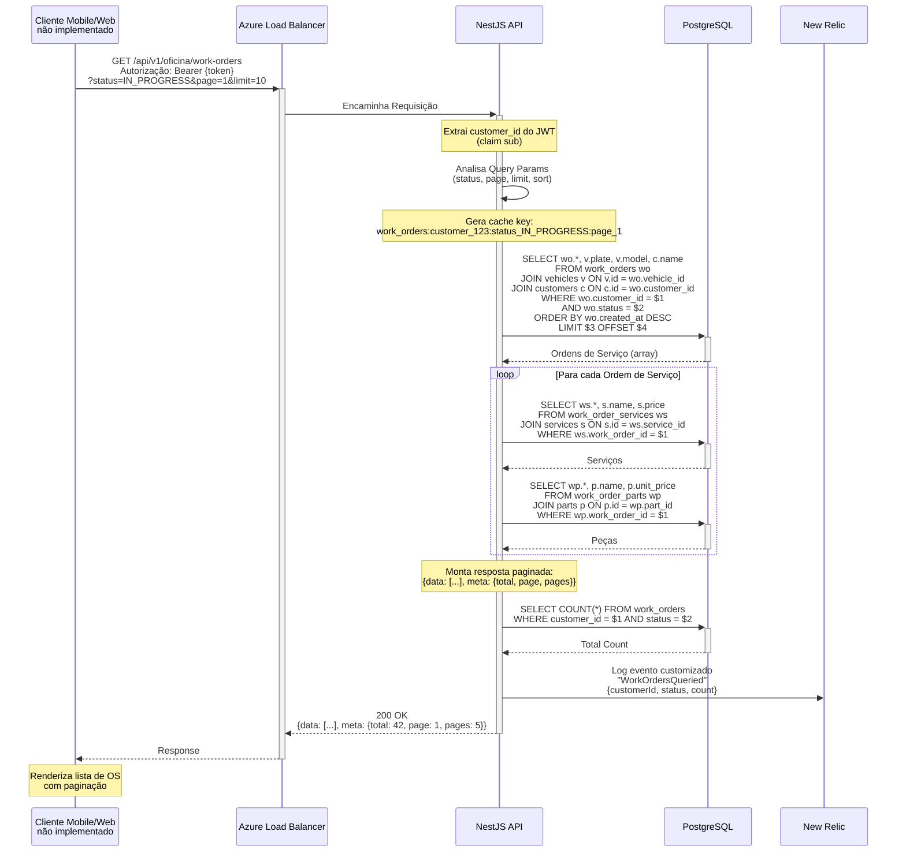
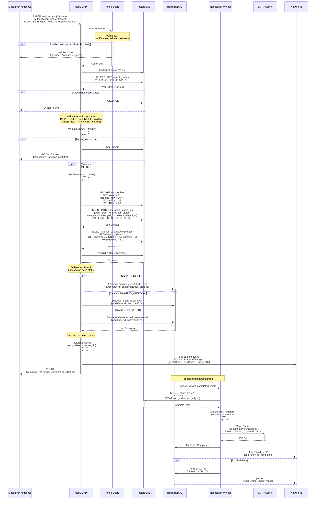
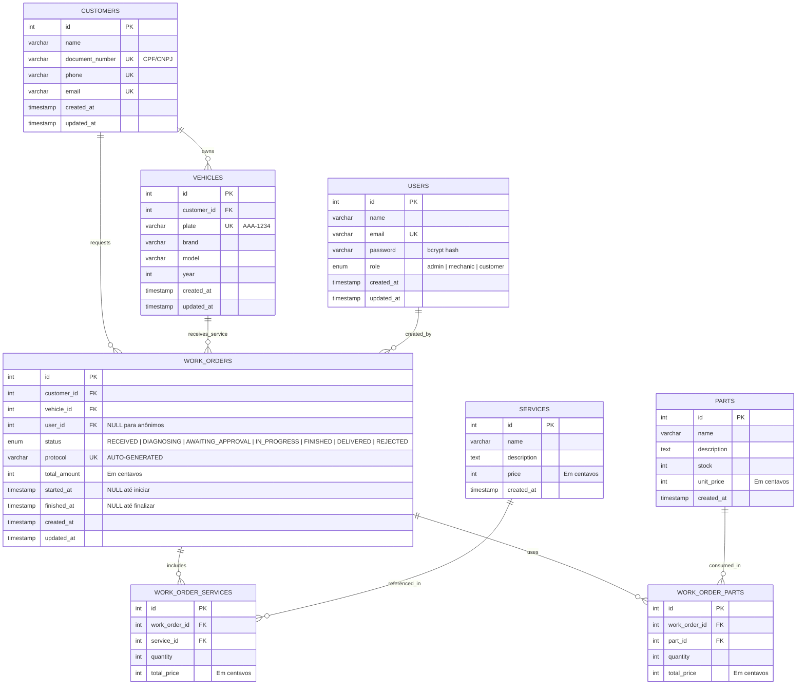
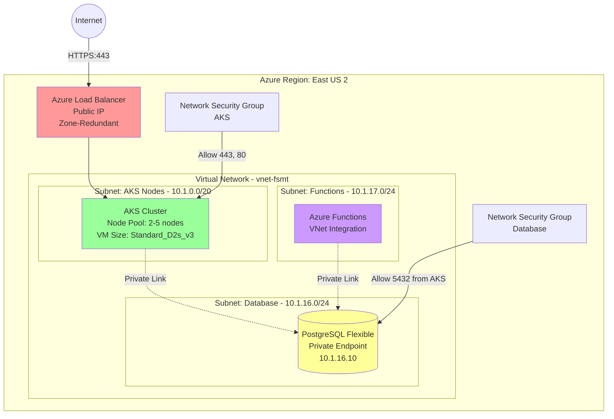
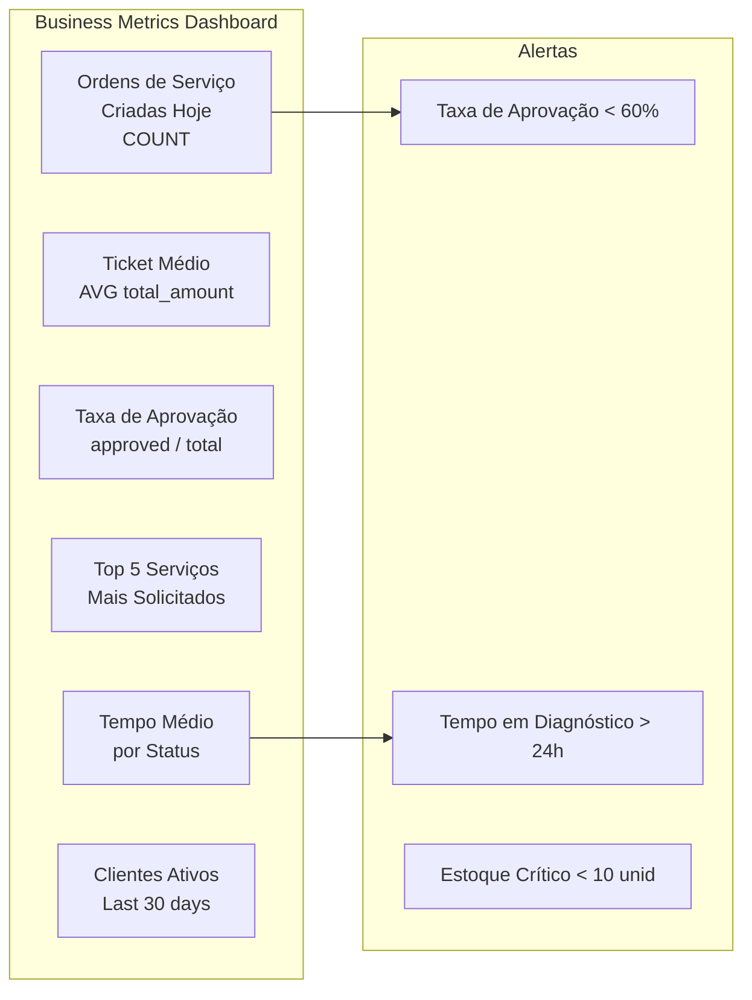

# Documentação da Arquitetura - Sistema FullStack Motors (FSMT)

**Projeto:** Tech Challenge - Fase 3 - SOAT12  
**Data:** Janeiro de 2026  
**Versão:** 1.0

---

## Índice

1. [Visão Geral](#visão-geral)
2. [Decisões Arquiteturais](#decisões-arquiteturais)
3. [Diagrama de Componentes](#diagrama-de-componentes)
4. [Diagramas de Sequência](#diagramas-de-sequência)
5. [Modelagem de Dados](#modelagem-de-dados)
6. [Infraestrutura](#infraestrutura)
7. [Observabilidade](#observabilidade)
8. [CI/CD](#cicd)
9. [ADRs - Architecture Decision Records](#adrs---architecture-decision-records)

---

## Visão Geral

O Sistema FullStack Motors (FSMT) é uma solução cloud-native para gestão de oficinas mecânicas, permitindo o controle completo de ordens de serviço, clientes, veículos, peças e serviços. O sistema foi projetado para ser escalável, resiliente e observável, utilizando as melhores práticas de arquitetura em nuvem.

### Objetivos do Sistema

- Gestão completa de ordens de serviço (OS)
- Controle de clientes e veículos
- Gerenciamento de estoque de peças
- Autenticação e autorização seguras
- Notificações automatizadas por e-mail
- Escalabilidade horizontal automática
- Observabilidade completa com métricas e logs

---

## Decisões Arquiteturais

### 1. Escolha do Cloud Provider: Microsoft Azure

**Decisão:** Utilizar Microsoft Azure como provedor de nuvem.

**Justificativa:**

1. **Serviços Gerenciados Maduros:**
   - Azure Kubernetes Service (AKS) oferece excelente integração com ferramentas de DevOps
   - Azure Database for PostgreSQL com alta disponibilidade nativa
   - Azure Functions para computação serverless com suporte nativo a Node.js

2. **Custo-Benefício:**
   - Créditos educacionais disponíveis para o projeto acadêmico
   - Pricing competitivo para workloads de médio porte
   - Free tier generoso para desenvolvimento e testes

3. **Integração com Ferramentas:**
   - Integração nativa com GitHub Actions para CI/CD
   - Azure Monitor e Application Insights para observabilidade
   - Azure Container Registry (ACR) para gerenciamento de imagens

4. **Segurança:**
   - Microsoft Entra ID (Azure AD) para gestão de identidade
   - Network Security Groups e Private Endpoints
   - Compliance com LGPD e certificações internacionais

5. **Ecossistema:**
   - Documentação extensa e comunidade ativa
   - Suporte a múltiplas linguagens e frameworks
   - Roadmap claro de evolução de produtos

**Alternativas Consideradas:**
- **AWS:** Mais complexa para iniciantes, custos menos previsíveis
- **GCP:** Menor presença no mercado brasileiro, menos recursos educacionais

---

### 2. Escolha do Banco de Dados: Azure Database for PostgreSQL

**Decisão:** Utilizar Azure Database for PostgreSQL (Flexible Server).

**Justificativa:**

1. **Características Técnicas:**
   - **ACID Compliance:** Garante consistência em transações críticas (ordens de serviço, estoque)
   - **Suporte a JSONB:** Permite flexibilidade para dados semi-estruturados quando necessário
   - **Full-text Search:** Facilita buscas por clientes, veículos e serviços
   - **Triggers e Functions:** Lógica de negócio próxima aos dados quando necessário

2. **Modelo de Dados Relacional:**
   - O domínio possui relacionamentos claros: Cliente → Veículo → Ordem de Serviço
   - Necessidade de integridade referencial estrita
   - Consultas complexas com múltiplos JOINs são comuns
   - Transações ACID são críticas para controle de estoque e faturamento

3. **Gerenciamento pelo Azure:**
   - **Backups Automáticos:** Ponto de recuperação até 35 dias
   - **Alta Disponibilidade:** Zone-redundant deployment disponível
   - **Escalabilidade Vertical:** Facilidade para aumentar CPU/memória sem downtime
   - **Read Replicas:** Para distribuição de carga de leitura
   - **Patches Automáticos:** Zero-downtime updates

4. **Segurança:**
   - Criptografia em trânsito (TLS 1.2+)
   - Criptografia em repouso (AES-256)
   - Private Link para acesso sem exposição à internet
   - Azure AD Authentication
   - Advanced Threat Protection

5. **Performance:**
   - Connection pooling nativo
   - Query Performance Insights
   - Automatic tuning e indexação recomendada
   - SSD storage com IOPS provisionados

6. **Custo:**
   - Modelo de precificação previsível (vCore + Storage)
   - Opção de Reserved Capacity para economia
   - Burstable tier para ambientes de dev/test

**Alternativas Consideradas:**
- **MySQL:** Menor suporte a tipos de dados avançados (JSONB, arrays)
- **SQL Server:** Custo mais elevado, complexidade desnecessária para o domínio
- **MongoDB:** Ausência de transações ACID robustas, modelo de dados não se beneficia de NoSQL
- **DynamoDB/Cosmos DB:** Over-engineering para o volume e complexidade esperados

---

### 3. Arquitetura de Autenticação: Serverless (Azure Functions)

**Decisão:** Implementar autenticação de clientes em Azure Functions separada da API principal.

**Justificativa:**

1. **Separação de Responsabilidades:**
   - Autenticação é um domínio distinto do core business
   - Permite evolução independente (ex: OAuth2, SSO)
   - Reduz acoplamento entre sistemas

2. **Escalabilidade Independente:**
   - Picos de autenticação podem diferir de picos de uso da API
   - Consumo baseado em execuções (pay-per-use)
   - Cold start aceitável para autenticação (~2-3s)

3. **Segurança:**
   - Reduz superfície de ataque da aplicação principal
   - Permite rate limiting específico para endpoints de auth
   - Facilita auditoria e compliance (logs segregados)

4. **Custo:**
   - Mais econômico que manter instâncias dedicadas
   - Free tier de 1M execuções/mês no Azure Functions

**Implementação:**
- Validação de CPF/CNPJ
- Consulta ao banco de dados (clientes cadastrados)
- Geração de JWT com claims customizados
- Retorno de access token

---

### 4. Orquestração: Azure Kubernetes Service (AKS)

**Decisão:** Deploy da aplicação principal em cluster Kubernetes gerenciado (AKS).

**Justificativa:**

1. **Escalabilidade:**
   - **Horizontal Pod Autoscaler (HPA):** Escala pods baseado em CPU/memória/métricas customizadas
   - **Cluster Autoscaler:** Adiciona/remove nodes automaticamente
   - Suporta crescimento orgânico do negócio

2. **Alta Disponibilidade:**
   - Multi-zone deployment
   - Self-healing automático (restart de pods falhados)
   - Rolling updates com zero downtime

3. **Portabilidade:**
   - Não há lock-in com Azure (K8s é padrão de mercado)
   - Facilita migração futura entre clouds
   - Desenvolvimento local com Minikube/Kind

4. **Gerenciamento Simplificado:**
   - Azure cuida do control plane (master nodes)
   - Upgrades de versão do Kubernetes gerenciados
   - Integração com Azure Monitor, Application Insights e New Relic

5. **Ecossistema Rico:**
   - Helm charts para aplicações comuns (Ingress, Redis, etc.)
   - Service mesh (Istio/Linkerd) para observabilidade avançada
   - GitOps com ArgoCD/Flux

---

### 5. Estratégia de Comunicação: REST + Message Queue (BullMQ/Redis)

**Decisão:** API REST síncrona para operações CRUD + BullMQ para processamento assíncrono.

**Justificativa:**

1. **REST para CRUD:**
   - Simplicidade e maturidade
   - Suporte universal (clientes web, mobile, integrações)
   - Caching HTTP nativo
   - Documentação automática com OpenAPI/Swagger

2. **Message Queue para Notificações:**
   - **Resiliência:** Retry automático em falhas de SMTP
   - **Desacoplamento:** Envio de e-mail não bloqueia criação de OS
   - **Escalabilidade:** Workers de e-mail podem escalar independentemente
   - **Observabilidade:** Monitoramento de filas e dead letters

3. **BullMQ + Redis:**
   - Performance superior (in-memory)
   - Persistência opcional (AOF/RDB)
   - Delayed jobs (ex: lembrete de aprovação após 24h)
   - Job prioritization

**Fluxos Assíncronos Implementados:**
- Envio de e-mail de boas-vindas (novo cliente)
- Notificação de orçamento aprovado
- Alertas de mudança de status da OS
- Relatórios agendados

---

### 6. Observabilidade: New Relic + Azure Monitor

**Decisão:** Implementar observabilidade híbrida com New Relic e Azure Monitor.

**Justificativa:**

1. **New Relic (APM + Monitoring):**
   - **Application Performance Monitoring:** Traces distribuídos entre API e Functions
   - **Dashboards Customizados:** Métricas de negócio (OS criadas/dia, tempo médio)
   - **Alertas Inteligentes:** Anomaly detection com ML
   - **Logs Estruturados:** Correlação automática request → logs → traces
   - **Free Tier:** 100GB/mês de dados ingeridos

2. **Azure Monitor (Infraestrutura):**
   - Métricas nativas do AKS (CPU, memória, rede)
   - Logs do Kubernetes (kubectl logs)
   - Container Insights para análise de pods
   - Integração com Azure Functions

3. **Pilares da Observabilidade Implementados:**

   **a) Métricas:**
   - Taxa de requisições (requests/sec)
   - Latência (p50, p95, p99)
   - Taxa de erro (4xx, 5xx)
   - Métricas de negócio (OS criadas, aprovações pendentes)

   **b) Logs:**
   - Estruturados em JSON
   - Correlation ID em todas as requisições
   - Nível ajustável (debug em dev, info em prod)
   - Retenção configurável (30 dias em prod)

   **c) Traces:**
   - Rastreamento distribuído entre serviços
   - Span detalhado de queries SQL
   - Identificação de gargalos (N+1 queries)

4. **Alertas Configurados:**
   - Latência > 2s (p95) por 5 minutos
   - Taxa de erro > 5% por 2 minutos
   - Fila de notificações > 1000 mensagens
   - CPU cluster > 80%
   - Disco banco de dados > 85%

---

## Diagrama de Componentes



### Descrição dos Componentes

| Componente | Tipo | Responsabilidade | Tecnologias | Configuração |
|------------|------|------------------|-------------|--------------|
| **Azure Load Balancer** | Managed Service | Distribuição de tráfego HTTP/HTTPS com IP público | Azure LB | IP: 4.152.102.148 |
| **API NestJS** | Container/Pod | API REST com endpoints para gestão de oficina:<br/>- Customers (clientes)<br/>- Vehicles (veículos)<br/>- Work Orders (ordens de serviço)<br/>- Parts (peças)<br/>- Services (serviços)<br/>- Users (usuários)<br/>- Auth (autenticação interna) | NestJS 11, TypeORM, Passport JWT, Swagger, Helmet | Replicas: 1-10 (HPA)<br/>CPU: 100m-500m<br/>RAM: 256Mi-512Mi<br/>Port: 3333 |
| **Redis + BullMQ** | Cache/Queue | Fila de processamento assíncrono para:<br/>- Envio de emails<br/>- Notificações de mudança de status<br/>- Jobs em background | Redis, BullMQ | Port: 6379<br/>Service: redis-service |
| **Azure Function - authClient** | Serverless | Autenticação de clientes externos via CPF/CNPJ:<br/>- Validação de documento<br/>- Query no banco de clientes<br/>- Geração de JWT com role 'client' | Azure Functions v4, Node.js, TypeScript | Auth Level: Anonymous<br/>Method: POST |
| **Azure Function - notification** | Serverless | Envio de notificações por email:<br/>- Confirmações de orçamento<br/>- Alertas de status<br/>- Comunicação com clientes | Azure Functions v4, Node.js | SMTP: Gmail 465 |
| **PostgreSQL Flexible Server** | Managed Database | Banco de dados relacional com:<br/>- 7 módulos de domínio<br/>- TypeORM migrations<br/>- Views e procedures<br/>- SSL obrigatório | PostgreSQL 15+ | Host: psql-oficina-fsmt-soat-12<br/>SSL Mode: require<br/>Schema: public |
| **Azure Container Registry** | Container Registry | Armazenamento e versionamento de imagens Docker | ACR | Registry: acrfsmt.azurecr.io<br/>Image: oficina-api:latest |
| **New Relic APM** | Observability | Monitoramento de aplicação:<br/>- Distributed tracing<br/>- APM metrics<br/>- Logs estruturados (Pino)<br/>- Custom events | New Relic Node.js Agent, Pino Enricher | App: 12_soat_main<br/>Auto-instrumentation: Enabled |
| **New Relic K8s Instrumentation** | Observability | Auto-instrumentação de pods no AKS:<br/>- Injeção automática do agent<br/>- Pod/namespace selector | New Relic Operator | Namespace: newrelic<br/>Target: app=oficina-api |
| **GitHub Actions** | CI/CD | Pipeline de integração e entrega contínua:<br/>- Build da aplicação<br/>- Testes (unit + e2e)<br/>- Push para ACR<br/>- Deploy no AKS | GitHub Actions | Triggers: push, PR |
| **Terraform** | IaC | Provisionamento de infraestrutura:<br/>- PostgreSQL Server<br/>- AKS Cluster<br/>- Load Balancer<br/>- Networking | Terraform | Provider: azurerm |

---

## Diagramas de Sequência

### 1. Fluxo de Autenticação de Cliente (CPF)



**Detalhes Técnicos:**
- **Validação:** Biblioteca `cpf-cnpj-validator` para verificar dígitos verificadores
- **JWT:** Assinado com HS256, expiração de 1 hora, claims customizados (role: client)
- **Segurança:** Rate limiting de 10 req/min por IP no Azure Function
- **Performance:** Cold start ~2s, warm execution ~150ms

---

### 2. Fluxo de Criação de Ordem de Serviço



**Detalhes de Implementação:**

1. **Transação Atômica:**
   - Utiliza isolamento `READ COMMITTED`
   - Rollback automático em qualquer falha
   - Lock em `parts` table para evitar race condition no estoque

2. **Validação em Camadas:**
   - **DTO:** class-validator (tipos, required fields)
   - **Business Logic:** Veículo pertence ao cliente? Estoque disponível?
   - **Database:** Foreign keys e constraints

3. **Cálculo de Preço:**
   ```typescript
   const totalServices = services.reduce((sum, s) => sum + (s.price * s.quantity), 0);
   const totalParts = parts.reduce((sum, p) => sum + (p.unit_price * p.quantity), 0);
   const total = totalServices + totalParts;
   ```

4. **Job Queue:**
   - Prioridade: normal (0)
   - Retry: 3 tentativas com backoff exponencial (1s, 5s, 25s)
   - TTL: 1 hora (após isso, job expira)

5. **E-mail Template:**
   - HTML responsivo
   - Dados: protocolo OS, serviços, peças, total, link de aprovação
   - BCC automático para gerência

---

### 3. Fluxo de Aprovação de Orçamento (Cliente)



**Detalhes de Implementação:**

1. **Validação de Propriedade:**
   - Query usa `customer_id` do JWT para garantir que apenas o dono pode aprovar
   - Previne IDOR (Insecure Direct Object Reference)

2. **Máquina de Estados:**
   - Apenas transições válidas são permitidas
   - AWAITING_APPROVAL → IN_PROGRESS (válido)
   - AWAITING_APPROVAL → REJECTED (válido via endpoint /reject)
   - Outras transições retornam 400

3. **Notificação Assíncrona:**
   - Oficina recebe e-mail imediatamente
   - Mecânico designado recebe notificação push (futuro)

---

### 4. Fluxo de Consulta de Ordens de Serviço (Cliente Autenticado)



**Detalhes de Implementação:**

1. **Estratégia de Cache:**
   - **Key Pattern:** `work_orders:customer_{id}:status_{status}:page_{page}`
   - **TTL:** 5 minutos (balance entre freshness e performance)
   - **Invalidação:** Cache é deletado quando:
     - Cliente aprova/rejeita orçamento
     - Status da OS muda
     - Nova OS é criada
   ```typescript
   const cacheKey = `work_orders:customer_${customerId}:status_${status}:page_${page}`;
   await redis.del(`work_orders:customer_${customerId}:*`); // wildcard invalidation
   ```

2. **Otimização de Queries:**
   - **Problema N+1:** Resolvido com eager loading
   ```typescript
   const workOrders = await this.workOrderRepository.find({
     where: { customerId, status },
     relations: ['vehicle', 'customer', 'services', 'parts'],
     take: limit,
     skip: (page - 1) * limit,
   });
   ```

3. **Paginação:**
   - Limite máximo: 50 items por página
   - Default: 10 items
   - Response inclui metadata:
   ```json
   {
     "data": [...],
     "meta": {
       "total": 42,
       "page": 1,
       "limit": 10,
       "pages": 5,
       "hasNext": true,
       "hasPrev": false
     }
   }
   ```

4. **Filtros Suportados:**
   - `status`: RECEIVED, DIAGNOSING, AWAITING_APPROVAL, IN_PROGRESS, FINISHED, DELIVERED, REJECTED
   - `startDate` / `endDate`: Range de datas
   - `vehicleId`: Filtro por veículo específico
   - `sort`: created_at, updated_at, total_amount (asc/desc)

5. **Segurança:**
   - Filtro automático por `customer_id` extraído do JWT
   - Impossível ver OS de outros clientes
   - Rate limit: 30 requisições/min por usuário

---

### 5. Fluxo de Atualização de Status da OS (Mecânico/Atendente)



**Detalhes de Implementação:**

1. **Máquina de Estados Completa:**
   ```typescript
   const ALLOWED_TRANSITIONS: Record<WorkOrderStatus, WorkOrderStatus[]> = {
     RECEIVED: ['DIAGNOSING', 'REJECTED'],
     DIAGNOSING: ['AWAITING_APPROVAL', 'REJECTED'],
     AWAITING_APPROVAL: ['IN_PROGRESS', 'REJECTED'],
     IN_PROGRESS: ['FINISHED'],
     FINISHED: ['DELIVERED'],
     DELIVERED: [], // Estado final
     REJECTED: [], // Estado final
   };
   
   validateTransition(currentStatus: string, newStatus: string): boolean {
     return ALLOWED_TRANSITIONS[currentStatus]?.includes(newStatus) ?? false;
   }
   ```

2. **Auditoria Completa (Status Log):**
   - Tabela `work_order_status_log` registra todas as mudanças:
   ```sql
   CREATE TABLE work_order_status_log (
     id SERIAL PRIMARY KEY,
     work_order_id INT NOT NULL REFERENCES work_orders(id),
     previous_status VARCHAR(50) NOT NULL,
     new_status VARCHAR(50) NOT NULL,
     changed_by INT REFERENCES users(id),
     notes TEXT,
     changed_at TIMESTAMP DEFAULT NOW()
   );
   ```

3. **Controle de Acesso (RBAC):**
   ```typescript
   @Roles('admin', 'mechanic')  // Decorator customizado
   @Patch(':id/status')
   async updateStatus(@Param('id') id: number, @Body() dto: UpdateStatusDto) {
     // Apenas admin e mechanic podem atualizar status
   }
   ```

4. **Notificações por Status:**
   | Status | Template Email | Destinatário | Ação do Cliente |
   |--------|---------------|--------------|-----------------|
   | DIAGNOSING | diagnostic-started.html | Cliente | Informativo |
   | AWAITING_APPROVAL | quote-ready.html | Cliente | Aprovar/Rejeitar |
   | IN_PROGRESS | service-started.html | Cliente | Informativo |
   | FINISHED | service-completed.html | Cliente | Agendar retirada |
   | DELIVERED | delivery-confirmed.html | Cliente | Feedback/Avaliação |
   | REJECTED | quote-rejected.html | Oficina | Análise |

5. **Timestamps Automáticos:**
   - `started_at`: Setado quando status = IN_PROGRESS
   - `finished_at`: Setado quando status = FINISHED
   - `updated_at`: Atualizado em toda mudança
   - Permite cálculo de SLA e tempo médio por etapa

6. **Concorrência:**
   - `SELECT ... FOR UPDATE`: Lock pessimista previne race conditions
   - Transação garante atomicidade entre update e log
   - Retry logic em caso de deadlock (max 3 tentativas)

7. **Observabilidade:**
   - Evento customizado no New Relic com todas as transições
   - Dashboard de "Status Transition Funnel"
   - Alertas para OS paradas em um status > 48h

---

## Modelagem de Dados

### Diagrama Entidade-Relacionamento (ER)



### Decisões de Modelagem

1. **Normalização:**
   - **3NF (Third Normal Form)** aplicada para evitar redundância
   - Tabelas de junção (`work_order_services`, `work_order_parts`) permitem muitos-para-muitos
   - Histórico de preços preservado nas tabelas de junção (não recalcula se serviço/peça mudar)

2. **Tipos de Dados:**
   - **Preços em centavos (integer):** Evita problemas de arredondamento com float/decimal
   - **ENUM para status:** Garante valores válidos no nível do banco
   - **UUID para protocolo:** Gerado via trigger PostgreSQL (`gen_random_uuid()`)

3. **Índices Criados:**
   ```sql
   CREATE INDEX idx_work_orders_customer ON work_orders(customer_id);
   CREATE INDEX idx_work_orders_status ON work_orders(status);
   CREATE INDEX idx_work_orders_created_at ON work_orders(created_at DESC);
   CREATE INDEX idx_vehicles_customer ON vehicles(customer_id);
   CREATE INDEX idx_customers_document ON customers(document_number);
   ```

4. **Constraints:**
   - **Foreign Keys com ON DELETE NO ACTION:** Preserva histórico (não permite deletar cliente com OS)
   - **Unique Constraints:** Email, CPF/CNPJ, placa do veículo
   - **Check Constraints:**
     ```sql
     CHECK (stock >= 0)  -- Evita estoque negativo
     CHECK (price > 0)   -- Preços devem ser positivos
     CHECK (year >= 1900 AND year <= EXTRACT(YEAR FROM CURRENT_DATE) + 1)
     ```

5. **Triggers Implementados:**
   ```sql
   -- Atualiza total_amount ao inserir serviços/peças
   CREATE TRIGGER update_work_order_total 
   AFTER INSERT ON work_order_services 
   FOR EACH ROW EXECUTE FUNCTION recalculate_total();

   -- Gera protocolo único (ex: WO-2026-00123)
   CREATE TRIGGER generate_protocol 
   BEFORE INSERT ON work_orders 
   FOR EACH ROW EXECUTE FUNCTION set_protocol();
   ```

6. **View para Consultas:**
   ```sql
   -- View materializada para dashboard de desempenho
   CREATE MATERIALIZED VIEW work_orders_summary AS
   SELECT 
       DATE(created_at) as date,
       status,
       COUNT(*) as count,
       AVG(total_amount) as avg_amount
   FROM work_orders
   GROUP BY DATE(created_at), status;
   ```

---

## Infraestrutura

### Arquitetura de Rede



### Recursos Provisionados (Terraform)

#### 1. **AKS Cluster**
```hcl
resource "azurerm_kubernetes_cluster" "aks" {
  name                = "aks-fsmt-soat12"
  location            = "East US 2"
  resource_group_name = azurerm_resource_group.rg.name
  dns_prefix          = "fsmt-k8s"
  
  default_node_pool {
    name                = "default"
    node_count          = 2
    vm_size             = "Standard_D2s_v3"
    enable_auto_scaling = true
    min_count           = 2
    max_count           = 5
    zones               = ["1", "2", "3"]
  }
  
  identity {
    type = "SystemAssigned"
  }
  
  network_profile {
    network_plugin     = "azure"
    load_balancer_sku  = "standard"
    network_policy     = "calico"
  }
  
  oms_agent {
    log_analytics_workspace_id = azurerm_log_analytics_workspace.law.id
  }
}
```

#### 2. **PostgreSQL Flexible Server**
```hcl
resource "azurerm_postgresql_flexible_server" "db" {
  name                = "psql-fsmt-soat12"
  location            = "East US 2"
  resource_group_name = azurerm_resource_group.rg.name
  
  sku_name   = "B_Standard_B1ms"  # 1 vCore, 2GB RAM (dev)
  version    = "15"
  storage_mb = 32768  # 32GB
  
  backup_retention_days        = 7
  geo_redundant_backup_enabled = false
  
  high_availability {
    mode = "ZoneRedundant"  # Produção
  }
  
  authentication {
    active_directory_auth_enabled = true
  }
}
```

#### 3. **Azure Functions**
```hcl
resource "azurerm_linux_function_app" "auth" {
  name                = "func-auth-soat12"
  location            = "East US 2"
  resource_group_name = azurerm_resource_group.rg.name
  service_plan_id     = azurerm_service_plan.plan.id
  
  site_config {
    application_stack {
      node_version = "18"
    }
    always_on = true
  }
  
  app_settings = {
    "DB_CONNECTION_STRING" = "@Microsoft.KeyVault(...)"
    "JWT_SECRET"           = "@Microsoft.KeyVault(...)"
  }
}
```

### Kubernetes Manifests

#### Deployment da API
```yaml
apiVersion: apps/v1
kind: Deployment
metadata:
  name: fsmt-api
  namespace: production
spec:
  replicas: 2
  selector:
    matchLabels:
      app: fsmt-api
  template:
    metadata:
      labels:
        app: fsmt-api
    spec:
      containers:
      - name: api
        image: acrfsmt.azurecr.io/fsmt-api:latest
        ports:
        - containerPort: 3333
        env:
        - name: DB_HOST
          valueFrom:
            secretKeyRef:
              name: db-secret
              key: host
        - name: DB_PASSWORD
          valueFrom:
            secretKeyRef:
              name: db-secret
              key: password
        - name: NEW_RELIC_LICENSE_KEY
          valueFrom:
            secretKeyRef:
              name: newrelic-secret
              key: license-key
        resources:
          requests:
            memory: "256Mi"
            cpu: "250m"
          limits:
            memory: "512Mi"
            cpu: "500m"
        livenessProbe:
          httpGet:
            path: /api/v1/oficina/health
            port: 3333
          initialDelaySeconds: 30
          periodSeconds: 10
        readinessProbe:
          httpGet:
            path: /api/v1/oficina/health
            port: 3333
          initialDelaySeconds: 5
          periodSeconds: 5
```

#### HorizontalPodAutoscaler
```yaml
apiVersion: autoscaling/v2
kind: HorizontalPodAutoscaler
metadata:
  name: fsmt-api-hpa
  namespace: production
spec:
  scaleTargetRef:
    apiVersion: apps/v1
    kind: Deployment
    name: fsmt-api
  minReplicas: 2
  maxReplicas: 10
  metrics:
  - type: Resource
    resource:
      name: cpu
      target:
        type: Utilization
        averageUtilization: 70
  - type: Resource
    resource:
      name: memory
      target:
        type: Utilization
        averageUtilization: 80
  behavior:
    scaleUp:
      stabilizationWindowSeconds: 30
      policies:
      - type: Percent
        value: 100
        periodSeconds: 15
    scaleDown:
      stabilizationWindowSeconds: 300
      policies:
      - type: Pods
        value: 1
        periodSeconds: 60
```

---

## Observabilidade

### Dashboards Implementados

#### 1. **Dashboard de Negócio (New Relic)**



**NRQL Queries:**
```sql
-- Ordens criadas hoje
SELECT count(*) FROM Transaction 
WHERE appName = '12_soat_main' 
AND name = 'WorkOrdersController.create' 
SINCE today

-- Ticket médio
SELECT average(total_amount) / 100 as 'Ticket Médio (R$)' 
FROM CustomEvent 
WHERE eventType = 'WorkOrderCreated' 
SINCE 1 week ago

-- Taxa de aprovação
SELECT 
  (filter(count(*), WHERE status = 'IN_PROGRESS') / count(*) * 100) as 'Taxa Aprovação %'
FROM CustomEvent 
WHERE eventType = 'WorkOrderStatusChanged' 
AND previousStatus = 'AWAITING_APPROVAL' 
SINCE 1 week ago
```

#### 2. **Dashboard Técnico (New Relic + Azure Monitor)**

| Métrica | Threshold | Ação |
|---------|-----------|------|
| **Latência p95** | < 500ms (OK), > 2s (Crítico) | Alert → Slack + PagerDuty |
| **Taxa de Erro** | < 1% (OK), > 5% (Crítico) | Auto-rollback deploy |
| **CPU Cluster** | < 70% (OK), > 90% (Crítico) | Scale out nodes |
| **DB Connections** | < 80 (OK), > 150 (Warning) | Increase pool size |
| **Queue Depth** | < 100 (OK), > 1000 (Critical) | Scale workers |

**Grafana Dashboard (via Prometheus):**
```yaml
# ServiceMonitor para coleta de métricas
apiVersion: v1
kind: Service
metadata:
  name: fsmt-api-metrics
  labels:
    app: fsmt-api
spec:
  ports:
  - name: metrics
    port: 9090
    targetPort: 9090
  selector:
    app: fsmt-api
```

### Logs Estruturados

**Formato Padrão (JSON):**
```json
{
  "timestamp": "2026-01-07T14:32:10.123Z",
  "level": "info",
  "message": "Work order created successfully",
  "context": "WorkOrdersService",
  "correlationId": "a1b2c3d4-e5f6-7890-abcd-ef1234567890",
  "userId": 42,
  "workOrderId": 1523,
  "totalAmount": 35000,
  "duration": 245,
  "metadata": {
    "servicesCount": 3,
    "partsCount": 5,
    "vehiclePlate": "ABC-1234"
  }
}
```

**Pipeline de Logs:**
1. **Aplicação** → Pino Logger (estruturado)
2. **Pino** → Stdout (container)
3. **FluentBit** (sidecar) → New Relic Logs API
4. **New Relic** → Indexação + Correlação com Traces

**Retenção:**
- Development: 7 dias
- Staging: 30 dias
- Production: 90 dias (compliance)

---

## CI/CD

### Pipeline de Deploy (GitHub Actions)

```mermaid
graph LR
    A[Git Push] --> B{Branch?}
    
    B -->|main| C[CI Pipeline]
    B -->|feature/*| D[CI Only]
    
    C --> E[Checkout Code]
    E --> F[Setup Node 18]
    F --> G[Install Dependencies]
    G --> H[Run Linter]
    H --> I[Run Unit Tests]
    I --> J[Run E2E Tests]
    
    J --> K{Tests Pass?}
    K -->|No| L[Notify Slack - Failed]
    K -->|Yes| M[Build Docker Image]
    
    M --> N[Tag Image<br/>sha-abc123 + latest]
    N --> O[Push to ACR]
    O --> P[Update K8s Manifests]
    P --> Q[Apply to AKS]
    
    Q --> R[Health Check]
    R --> S{Healthy?}
    S -->|No| T[Rollback]
    S -->|Yes| U[Notify Slack - Success]
    
    T --> L
    
    style K fill:#ffcccc
    style S fill:#ffcccc
    style U fill:#ccffcc
    style L fill:#ff9999
```



### Workflow Completo (.github/workflows/deploy.yml)

```yaml
name: CI/CD Pipeline

on:
  push:
    branches: [main, develop]
  pull_request:
    branches: [main]

env:
  REGISTRY: acrfsmt.azurecr.io
  IMAGE_NAME: fsmt-api
  AKS_CLUSTER: aks-fsmt-soat12
  RESOURCE_GROUP: rg-fsmt-soat12

jobs:
  test:
    runs-on: ubuntu-latest
    steps:
      - uses: actions/checkout@v3
      
      - name: Setup Node.js
        uses: actions/setup-node@v3
        with:
          node-version: '18'
          cache: 'npm'
      
      - name: Install dependencies
        run: npm ci
      
      - name: Run linter
        run: npm run lint
      
      - name: Run unit tests
        run: npm run test:cov
      
      - name: Upload coverage to Codecov
        uses: codecov/codecov-action@v3
        with:
          files: ./coverage/lcov.info

  build-and-push:
    needs: test
    runs-on: ubuntu-latest
    if: github.ref == 'refs/heads/main'
    
    steps:
      - uses: actions/checkout@v3
      
      - name: Login to ACR
        uses: azure/docker-login@v1
        with:
          login-server: ${{ env.REGISTRY }}
          username: ${{ secrets.ACR_USERNAME }}
          password: ${{ secrets.ACR_PASSWORD }}
      
      - name: Build and push
        run: |
          IMAGE_TAG=${{ env.REGISTRY }}/${{ env.IMAGE_NAME }}:${{ github.sha }}
          IMAGE_LATEST=${{ env.REGISTRY }}/${{ env.IMAGE_NAME }}:latest
          
          docker build -t $IMAGE_TAG -t $IMAGE_LATEST .
          docker push $IMAGE_TAG
          docker push $IMAGE_LATEST
          
          echo "IMAGE_TAG=$IMAGE_TAG" >> $GITHUB_ENV

  deploy:
    needs: build-and-push
    runs-on: ubuntu-latest
    
    steps:
      - uses: actions/checkout@v3
      
      - name: Azure Login
        uses: azure/login@v1
        with:
          creds: ${{ secrets.AZURE_CREDENTIALS }}
      
      - name: Set AKS context
        uses: azure/aks-set-context@v3
        with:
          cluster-name: ${{ env.AKS_CLUSTER }}
          resource-group: ${{ env.RESOURCE_GROUP }}
      
      - name: Create namespace if not exists
        run: |
          kubectl create namespace production --dry-run=client -o yaml | kubectl apply -f -
      
      - name: Deploy to AKS
        run: |
          kubectl set image deployment/fsmt-api \
            api=${{ env.REGISTRY }}/${{ env.IMAGE_NAME }}:${{ github.sha }} \
            -n production
          
          kubectl rollout status deployment/fsmt-api -n production --timeout=5m
      
      - name: Health check
        run: |
          sleep 30
          kubectl run curl-test --image=curlimages/curl:7.85.0 --rm -i --restart=Never -- \
            curl -f http://fsmt-api-service.production.svc.cluster.local:3333/api/v1/oficina/health
      
      - name: Notify Slack - Success
        if: success()
        uses: slackapi/slack-github-action@v1.24.0
        with:
          webhook-url: ${{ secrets.SLACK_WEBHOOK }}
          payload: |
            {
              "text": " Deploy successful to AKS (commit: ${{ github.sha }})"
            }
      
      - name: Notify Slack - Failure
        if: failure()
        uses: slackapi/slack-github-action@v1.24.0
        with:
          webhook-url: ${{ secrets.SLACK_WEBHOOK }}
          payload: |
            {
              "text": " Deploy failed (commit: ${{ github.sha }})"
            }
```

### Estratégia de Deploy

1. **Rolling Update:**
   - MaxSurge: 1 (cria 1 pod extra durante update)
   - MaxUnavailable: 0 (nunca menos que minReplicas)
   - Rollout gradual: 25% a cada 30s

2. **Rollback Automático:**
   - Se health check falhar após 5min → rollback
   - Se error rate > 10% nos primeiros 2min → rollback
   - Comando manual: `kubectl rollout undo deployment/fsmt-api -n production`

3. **Ambientes:**
   - **Development:** Deploy automático em `develop` branch → namespace `dev`
   - **Staging:** Deploy automático em `staging` branch → namespace `staging`
   - **Production:** Deploy automático em `main` branch → namespace `production` (requer aprovação manual via GitHub Environments)

---

## Segurança

### Implementações de Segurança

1. **Autenticação e Autorização:**
   - JWT com rotação de secret a cada 90 dias
   - RBAC no Kubernetes (ServiceAccounts por namespace)
   - Azure AD integration para acesso ao AKS

2. **Secrets Management:**
   - Azure Key Vault para secrets sensíveis
   - Kubernetes Secrets com encryption at rest (etcd)
   - Nunca commitar secrets no Git (validado via pre-commit hooks)

3. **Network Security:**
   - Network Policies (Calico) bloqueando tráfego entre namespaces
   - Private Endpoints para PostgreSQL (sem IP público)
   - TLS 1.2+ obrigatório (cert-manager + Let's Encrypt)

4. **Container Security:**
   - Imagens base oficiais (node:18-alpine)
   - Scan de vulnerabilidades (Trivy) no CI
   - Execução como non-root user
   - ReadOnlyRootFilesystem habilitado

5. **Database Security:**
   - Criptografia em repouso (AES-256)
   - Criptografia em trânsito (SSL/TLS)
   - Connection pooling com timeout
   - Audit logs habilitados

6. **Application Security:**
   - Helmet.js para headers HTTP seguros
   - Rate limiting (10 req/s por IP)
   - Input validation com class-validator
   - SQL injection prevenido (TypeORM parameterized queries)
   - XSS protection (sanitização de inputs)

---

## Custos Estimados (Azure - East US 2)

| Recurso | Especificação | Custo Mensal (USD) |
|---------|---------------|-------------------|
| **AKS Cluster** | 2x Standard_D2s_v3 (2 vCPU, 8GB RAM) | ~$140 |
| **PostgreSQL** | B_Standard_B1ms (1 vCore, 2GB RAM, 32GB storage) | ~$25 |
| **Azure Functions** | B1 Plan (1 vCPU, 1.75GB RAM, always-on) | ~$13 |
| **Azure Container Registry** | Basic (10GB storage) | ~$5 |
| **Load Balancer** | Standard (5 rules, 100GB data) | ~$20 |
| **Blob Storage** | 50GB (backups & logs) | ~$1 |
| **Bandwidth** | 100GB egress | ~$8 |
| **New Relic** | Free Tier (100GB/mês) | $0 |
| **Azure Monitor** | 5GB logs/mês | ~$12 |
| **TOTAL** | | **~$224/mês** |

**Otimizações de Custo:**
- Reserved Instances para AKS (save 30-40%)
- Spot Instances para workloads não-críticos
- Auto-shutdown de ambientes dev/staging fora do horário comercial
- Lifecycle policies para arquivar backups antigos em Azure Archive Storage

---

## ADRs - Architecture Decision Records

As decisões arquiteturais do sistema estão documentadas em arquivo separado para facilitar manutenção e referência.

**Documento:** [ADRs.md](ADRs.md)

**Conteúdo:**
- 8 ADRs implementados documentando decisões permanentes
- Justificativas técnicas baseadas no código real
- Referências aos arquivos de implementação
- Resumo consolidado de todas as decisões

---

## Roadmap Futuro


### Fase 4 (Q2 2026) - Expansão
- Multi-região (failover automático)
- CDN para assets estáticos
- GraphQL Gateway (Apollo Federation)
- Implementação de CQRS + Event Sourcing

### Fase 5 (Q3 2026) - IA & Analytics
- Chatbot com Azure OpenAI para atendimento
- Previsão de demanda com Azure ML
- Recomendação de serviços baseada em histórico
- Data Lake para analytics avançado

### Fase 6 (Q4 2026) - Mobile & IoT
- App mobile nativo (React Native)
- Integração com IoT para diagnóstico veicular
- Pagamento integrado (Stripe/PagSeguro)
- Gamificação e programa de fidelidade

---

## Conclusão

Esta arquitetura foi projetada para atender aos requisitos de **escalabilidade, resiliência, segurança e observabilidade** do Sistema FullStack Motors. As decisões técnicas foram baseadas em:

1. **Pragmatismo:** Escolha de tecnologias maduras e amplamente adotadas
2. **Cloud-Native:** Máximo uso de serviços gerenciados para reduzir overhead operacional
3. **Cost-Effectiveness:** Balanceamento entre features e custo de infraestrutura
4. **Developer Experience:** Ferramentas e fluxos que aumentam produtividade
5. **Business Value:** Foco em métricas que importam para o negócio

A combinação de **Azure (IaaS/PaaS)**, **Kubernetes (orquestração)**, **PostgreSQL (dados transacionais)**, **Redis (cache/queue)** e **New Relic (observabilidade)** fornece uma base sólida para crescimento sustentável da plataforma.

---

## Referências

- [Azure Kubernetes Service Best Practices](https://learn.microsoft.com/azure/aks/best-practices)
- [PostgreSQL High Performance Tuning](https://www.postgresql.org/docs/15/performance-tips.html)
- [NestJS Documentation](https://docs.nestjs.com)
- [Twelve-Factor App Methodology](https://12factor.net)
- [New Relic APM Best Practices](https://docs.newrelic.com/docs/apm/)
- [Terraform Azure Provider](https://registry.terraform.io/providers/hashicorp/azurerm/latest/docs)

---

**Documento elaborado por:** Equipe SOAT12  
**Última atualização:** 07 de Janeiro de 2026  
**Versão:** 1.0
