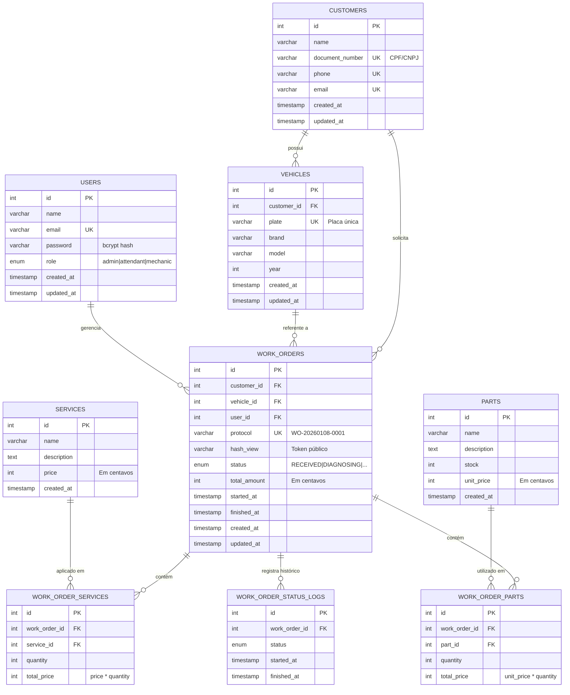
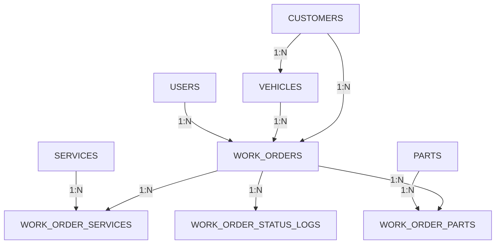
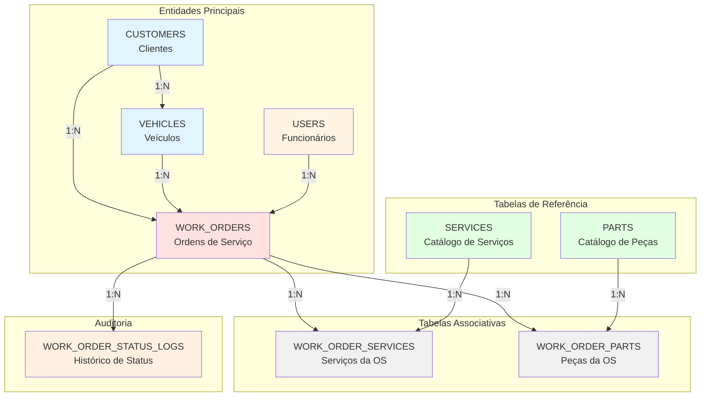

# Justificativa Técnica do Banco de Dados e Modelo Relacional

## Índice

1. [Escolha do PostgreSQL](#escolha-do-postgresql)
2. [Modelo de Dados Relacional](#modelo-de-dados-relacional)
3. [Diagrama Entidade-Relacionamento](#diagrama-entidade-relacionamento)
4. [Descrição das Entidades](#descricao-das-entidades)
5. [Relacionamentos e Cardinalidades](#relacionamentos-e-cardinalidades)
6. [Normalização e Integridade](#normalizacao-e-integridade)
7. [Justificativas de Design](#justificativas-de-design)
8. [Evolução do Schema](#evolucao-do-schema)

---

## Escolha do PostgreSQL

### Requisitos do Sistema

O sistema FSMT (Full Stack Motors) possui requisitos que direcionam a escolha de uma solução relacional:

1. **Transações ACID:**
   - Criação de ordem de serviço com múltiplos serviços/peças (atomicidade)
   - Atualização de estoque simultaneamente à criação de OS (consistência)
   - Mudança de status com log de auditoria (durabilidade)
   - Cálculo de total_amount baseado em relacionamentos (isolamento)

2. **Relacionamentos Complexos:**
   - Cliente possui múltiplos veículos (1:N)
   - Veículo possui múltiplas ordens de serviço (1:N)
   - Ordem de serviço possui múltiplos serviços e peças (N:N)
   - Necessidade de JOINs em 90% das queries principais

3. **Integridade Referencial:**
   - Impossibilidade de criar OS sem cliente/veículo válido
   - Impossibilidade de deletar peça com OS associada
   - Constraints de unicidade (placa, CPF, email, protocolo)

### PostgreSQL vs Alternativas

#### Comparação com MySQL

**Vantagens do PostgreSQL:**
- JSONB nativo para dados semi-estruturados (metadata de OS)
- Arrays nativos (útil para tags, categorias futuras)
- Full-text search superior (busca de clientes/serviços)
- Window functions mais robustas (relatórios analíticos)
- CTEs (Common Table Expressions) otimizadas

**Implementação no Código:**
```typescript
// database.config.ts (linha 40)
return {
  type: 'postgres',
  host: envConfigService.get('DB_HOST'),
  port: parseInt(envConfigService.get('DB_PORT')),
  // ... configuração PostgreSQL
}
```

**Evidência no Código:**
```typescript
// init-db.sql
CREATE EXTENSION IF NOT EXISTS "uuid-ossp";
```
PostgreSQL oferece extensões nativas que enriquecem funcionalidades.

### Configuração de Ambiente

**Ambiente de Desenvolvimento/Produção:**
```typescript
// database.config.ts (linha 41-54)
{
  type: 'postgres',
  host: envConfigService.get('DB_HOST'),      // Azure PostgreSQL
  port: parseInt(envConfigService.get('DB_PORT')), // 5432
  username: envConfigService.get('DB_USERNAME'),
  password: envConfigService.get('DB_PASSWORD'),
  database: envConfigService.get('DB_DATABASE'),
  ssl: { rejectUnauthorized: false },         // Azure requer SSL
}
```

**Ambiente de Testes:**

O sistema utiliza estratégias diferentes de banco de dados para testes dependendo do ambiente:

**Testes Locais (Desenvolvedor) - SQLite:**
```typescript
// database.config.ts (linha 20-35)
if (nodeEnv === 'test') {
  return {
    type: 'sqlite',
    database: ':memory:',
    synchronize: true,
    dropSchema: true,
  }
}
```

**Justificativa do SQLite em Testes Locais:**
- Velocidade extrema (execução em memória)
- Isolamento total (cada teste roda em banco separado)
- Zero configuração (sem necessidade de container ou servidor)
- Ideal para testes unitários e desenvolvimento rápido

**Testes CI/CD - PostgreSQL:**

No pipeline de CI/CD (GitHub Actions), é utilizado um container PostgreSQL real para garantir paridade com produção.

**Configuração:**
```yaml
# .github/workflows/test.yml
services:
  postgres:
    image: postgres:15
    env:
      POSTGRES_PASSWORD: test
      POSTGRES_DB: oficina_test
    options: >-
      --health-cmd pg_isready
      --health-interval 10s
      --health-timeout 5s
      --health-retries 5
```

**Justificativa do PostgreSQL em CI/CD:**
- Paridade com ambiente de produção (evita bugs específicos do PostgreSQL)
- Valida migrations reais (SQLite não suporta todas as features)
- Testa constraints e triggers nativos do PostgreSQL
- Garante compatibilidade com tipos de dados específicos (JSONB, ENUM, arrays)

---

## Modelo de Dados Relacional

### Diagrama Entidade-Relacionamento (ERD)



---

## Descrição das Entidades

### 1. CUSTOMERS (Clientes)

**Propósito:** Cadastro de clientes (pessoas físicas ou jurídicas).

**Implementação:**
```typescript
// customer.entity.ts
@Entity('customers')
export class Customer {
  @PrimaryGeneratedColumn()
  id: number

  @Column({ type: 'varchar', length: 100 })
  name: string

  @Column({ type: 'varchar', length: 20, unique: true, name: 'document_number' })
  documentNumber: string  // CPF ou CNPJ

  @Column({ type: 'varchar', length: 20, nullable: true, unique: true })
  phone: string

  @Column({ type: 'varchar', length: 100, unique: true })
  email: string

  @OneToMany('Vehicle', 'customer')
  vehicles: Vehicle[]

  @OneToMany('WorkOrder', 'customer')
  workOrders: WorkOrder[]
}
```

**Constraints:**
- `document_number` UNIQUE: Um CPF/CNPJ = um cadastro
- `email` UNIQUE: Evita duplicação de contas
- `phone` UNIQUE e NULLABLE: Cliente pode não ter telefone

**Justificativa de Design:**
- `document_number` como identificador de negócio (não PK por ser mutável em casos raros)
- Separação entre `documentNumber` (negócio) e `id` (técnico)

---

### 2. VEHICLES (Veículos)

**Propósito:** Cadastro de veículos vinculados a clientes.

**Implementação:**
```typescript
// vehicle.entity.ts
@Entity('vehicles')
export class Vehicle {
  @PrimaryGeneratedColumn()
  id: number

  @Column({ type: 'int', name: 'customer_id' })
  customerId: number

  @Column({ type: 'varchar', length: 10, unique: true })
  plate: string  // Placa do veículo

  @Column({ type: 'varchar', length: 50 })
  brand: string

  @Column({ type: 'varchar', length: 50 })
  model: string

  @Column({ type: 'int' })
  year: number

  @ManyToOne('Customer', 'vehicles')
  @JoinColumn({ name: 'customer_id' })
  customer: Customer
}
```

**Constraints:**
- `plate` UNIQUE: Uma placa = um veículo (regra DETRAN)
- Foreign Key `customer_id`: Veículo obrigatoriamente vinculado a cliente

**Justificativa de Design:**
- Separação de `vehicles` evita denormalização
- Um cliente pode ter múltiplos veículos (frota empresarial)
- Histórico de manutenção vinculado ao veículo (não ao cliente)

---

### 3. USERS (Usuários Internos)

**Propósito:** Funcionários da oficina (atendentes, mecânicos, administradores).

**Implementação:**
```typescript
// user.entity.ts
@Entity('users')
export class User {
  @PrimaryGeneratedColumn()
  id: number

  @Column({ type: 'varchar', length: 100 })
  name: string

  @Column({ type: 'varchar', length: 100, unique: true })
  email: string

  @Column({ type: 'varchar', length: 255 })
  password: string  // bcrypt hash

  @Column({ type: 'simple-enum', enum: UserRole, default: UserRole.ATTENDANT })
  role: UserRole  // admin | attendant | mechanic
}
```

**Constraints:**
- `email` UNIQUE: Login único por usuário
- `password` não nullable: Autenticação obrigatória

**Justificativa de Design:**
- Separação entre `customers` (autenticam via CPF) e `users` (autenticam via email/senha)
- `role` enum para controle de permissões (RBAC)

---

### 4. WORK_ORDERS (Ordens de Serviço)

**Propósito:** Núcleo do sistema - representa solicitação de serviço.

**Implementação:**
```typescript
// work-order.entity.ts
@Entity('work_orders')
export class WorkOrder {
  @PrimaryGeneratedColumn()
  id: number

  @Column({ type: 'int', name: 'customer_id' })
  customerId: number

  @Column({ type: 'int', name: 'vehicle_id' })
  vehicleId: number

  @Column({ type: 'int', name: 'user_id' })
  userId: number

  @Column({ type: 'varchar', name: 'protocol', unique: true })
  protocol: string  // WO-20260108-0001

  @Column({ type: 'varchar', name: 'hash_view', nullable: true })
  hashView: string  // Token para consulta pública

  @Column({ type: 'simple-enum', enum: WorkOrderStatusEnum })
  status: WorkOrderStatusEnum

  @Column({ type: 'int', default: 0, name: 'total_amount' })
  totalAmount: number  // Em centavos

  @Column(columnDate({ name: 'started_at' }))
  startedAt: Date

  @Column(columnDate({ name: 'finished_at', nullable: true }))
  finishedAt: Date

  @ManyToOne('Customer', 'workOrders')
  customer: Customer

  @ManyToOne('Vehicle', 'workOrders')
  vehicle: Vehicle

  @ManyToOne('User', 'workOrders')
  user: User
}
```

**Constraints:**
- `protocol` UNIQUE: Identificador único de negócio
- Foreign Keys obrigatórias: `customer_id`, `vehicle_id`, `user_id`
- `status` enum: Valores predefinidos (state machine)

**Justificativa de Design:**
- `protocol` gerado via lógica de negócio (padrão WO-YYYYMMDD-NNNN)
- `hash_view` permite consulta pública sem autenticação
- `total_amount` em centavos evita problemas de ponto flutuante
- `user_id` rastreia responsável pela OS (atendente/mecânico)

---

### 5. WORK_ORDER_SERVICES (Serviços da OS)

**Propósito:** Tabela associativa N:N entre work_orders e services.

**Implementação:**
```typescript
// work-order-service.entity.ts
@Entity('work_order_services')
export class WorkOrderService {
  @PrimaryGeneratedColumn()
  id: number

  @Column({ type: 'int', name: 'work_order_id' })
  workOrderId: number

  @Column({ type: 'int', name: 'service_id' })
  serviceId: number

  @Column({ type: 'int', default: 1 })
  quantity: number

  @Column({ type: 'int', name: 'total_price' })
  totalPrice: number  // service.price * quantity

  @ManyToOne('WorkOrder', 'workOrderServices')
  workOrder: WorkOrder

  @ManyToOne('Service', 'workOrderServices')
  service: Service
}
```

**Constraints:**
- Foreign Keys: `work_order_id`, `service_id`
- `quantity` default 1: Maioria dos serviços é única por OS

**Justificativa de Design:**
- `total_price` desnormalizado para evitar recálculo (preço pode mudar)
- Padrão N:N com atributos extras (quantity, total_price)

---

### 6. WORK_ORDER_PARTS (Peças da OS)

**Propósito:** Tabela associativa N:N entre work_orders e parts.

**Implementação:**
```typescript
// work-order-part.entity.ts
@Entity('work_order_parts')
export class WorkOrderPart {
  @PrimaryGeneratedColumn()
  id: number

  @Column({ type: 'int', name: 'work_order_id' })
  workOrderId: number

  @Column({ type: 'int', name: 'part_id' })
  partId: number

  @Column({ type: 'int', default: 1 })
  quantity: number

  @Column({ type: 'int', name: 'total_price' })
  totalPrice: number  // part.unit_price * quantity
}
```

**Constraints:**
- Idênticos a `work_order_services`

**Justificativa de Design:**
- Separação de `services` e `parts` permite controle de estoque apenas em peças
- `quantity` relevante (ex: 4 pneus, 5 litros de óleo)

---

### 7. SERVICES (Catálogo de Serviços)

**Propósito:** Tabela de preços de serviços oferecidos.

**Implementação:**
```typescript
// service.entity.ts
@Entity('services')
export class Service {
  @PrimaryGeneratedColumn()
  id: number

  @Column({ type: 'varchar', length: 100 })
  name: string  // "Troca de óleo", "Alinhamento"

  @Column({ type: 'text', nullable: true })
  description: string

  @Column({ type: 'int' })
  price: number  // Em centavos
}
```

**Justificativa de Design:**
- Catálogo centralizado (manutenção de preços simplificada)
- `description` opcional (serviços podem ser auto-explicativos)

---

### 8. PARTS (Catálogo de Peças)

**Propósito:** Tabela de peças com controle de estoque.

**Implementação:**
```typescript
// part.entity.ts
@Entity('parts')
export class Part {
  @PrimaryGeneratedColumn()
  id: number

  @Column({ type: 'varchar', length: 100 })
  name: string

  @Column({ type: 'text', nullable: true })
  description: string

  @Column({ type: 'int', default: 0 })
  stock: number  // Quantidade em estoque

  @Column({ type: 'int', name: 'unit_price' })
  unitPrice: number  // Em centavos
}
```

**Justificativa de Design:**
- `stock` permite validação pré-criação de OS
- `unit_price` separado de `services.price` (podem ter diferentes políticas)

---

### 9. WORK_ORDER_STATUS_LOGS (Histórico de Status)

**Propósito:** Auditoria de mudanças de status da OS.

**Implementação:**
```typescript
// work-order-status-log.entity.ts
@Entity('work_order_status_logs')
export class WorkOrderStatusLog {
  @PrimaryGeneratedColumn()
  id: number

  @Column({ type: 'int', name: 'work_order_id' })
  workOrderId: number

  @Column({ type: 'simple-enum', enum: WorkOrderStatusEnum })
  status: WorkOrderStatusEnum

  @Column(columnDate({ name: 'started_at' }))
  startedAt: Date

  @Column(columnDate({ name: 'finished_at', nullable: true }))
  finishedAt: Date | null
}
```

**Justificativa de Design:**
- Rastreabilidade completa (tempo em cada status)
- Cálculo de SLA (tempo médio em AWAITING_APPROVAL)
- Futuro: Identificação de gargalos no processo

---

## Relacionamentos e Cardinalidades

### Mapeamento Completo



### Detalhamento de Relacionamentos

#### 1. CUSTOMERS → VEHICLES (1:N)

**Cardinalidade:** Um cliente possui zero ou mais veículos.

**Implementação:**
```sql
-- Migration 1754595409303-initial.ts (linha 9)
ALTER TABLE "vehicles" 
ADD CONSTRAINT "FK_c1cda98f67cb9c79a1f1153e627" 
FOREIGN KEY ("customer_id") REFERENCES "customers"("id");
```

**Justificativa:**
- Cliente pode ter múltiplos veículos (frota empresarial)
- Veículo sempre vinculado a um cliente (ON DELETE NO ACTION impede órfãos)

**Query Exemplo:**
```typescript
const customerWithVehicles = await customerRepository.findOne({
  where: { id: 1 },
  relations: ['vehicles']
});
// SELECT * FROM customers WHERE id = 1
// SELECT * FROM vehicles WHERE customer_id = 1
```

---

#### 2. CUSTOMERS → WORK_ORDERS (1:N)

**Cardinalidade:** Um cliente pode ter múltiplas ordens de serviço.

**Implementação:**
```sql
ALTER TABLE "work_orders" 
ADD CONSTRAINT "FK_a9cd45a23c6212aaa1737d69163" 
FOREIGN KEY ("customer_id") REFERENCES "customers"("id");
```

**Justificativa:**
- Histórico de todas as OS do cliente
- Permite análise de ticket médio, recorrência

---

#### 3. VEHICLES → WORK_ORDERS (1:N)

**Cardinalidade:** Um veículo pode ter múltiplas ordens de serviço.

**Implementação:**
```sql
ALTER TABLE "work_orders" 
ADD CONSTRAINT "FK_18fb19db181c9e178cc8e5b6c8f" 
FOREIGN KEY ("vehicle_id") REFERENCES "vehicles"("id");
```

**Justificativa:**
- Histórico de manutenção por veículo
- Crítico para garantia e rastreabilidade

**Query Exemplo:**
```typescript
const vehicleHistory = await workOrderRepository.find({
  where: { vehicleId: 5 },
  order: { createdAt: 'DESC' }
});
// SELECT * FROM work_orders WHERE vehicle_id = 5 ORDER BY created_at DESC
```

---

#### 4. USERS → WORK_ORDERS (1:N)

**Cardinalidade:** Um usuário pode gerenciar múltiplas ordens de serviço.

**Implementação:**
```typescript
// work-order.entity.ts (linha 29)
@ManyToOne('User', 'workOrders')
@JoinColumn({ name: 'user_id' })
user: User
```

**Justificativa:**
- Rastreabilidade de responsabilidade
- Cálculo de produtividade por atendente/mecânico

---

#### 5. WORK_ORDERS → WORK_ORDER_SERVICES (1:N)

**Cardinalidade:** Uma OS possui um ou mais serviços.

**Implementação:**
```sql
ALTER TABLE "work_order_services" 
ADD CONSTRAINT "FK_f1e89a9b35b96435fbdc07670bb" 
FOREIGN KEY ("work_order_id") REFERENCES "work_orders"("id");
```

**Justificativa:**
- Relacionamento N:N com atributos extras (quantity, total_price)
- Permite múltiplos serviços na mesma OS

---

#### 6. SERVICES → WORK_ORDER_SERVICES (1:N)

**Cardinalidade:** Um serviço pode ser aplicado em múltiplas OS.

**Implementação:**
```sql
ALTER TABLE "work_order_services" 
ADD CONSTRAINT "FK_528ca0a8131271b124ff0c49581" 
FOREIGN KEY ("service_id") REFERENCES "services"("id");
```

**Justificativa:**
- Catálogo centralizado de serviços
- Atualização de preço não afeta OS antigas

---

#### 7. WORK_ORDERS → WORK_ORDER_PARTS (1:N)

**Implementação:** Idêntica a `work_order_services`.

---

#### 8. PARTS → WORK_ORDER_PARTS (1:N)

**Implementação:** Idêntica a `services → work_order_services`.

---

#### 9. WORK_ORDERS → WORK_ORDER_STATUS_LOGS (1:N)

**Cardinalidade:** Uma OS possui múltiplos registros de status.

**Justificativa:**
- Auditoria completa de mudanças de estado
- Cálculo de tempo médio por status

**Query Exemplo:**
```typescript
const statusHistory = await statusLogRepository.find({
  where: { workOrderId: 10 },
  order: { startedAt: 'ASC' }
});
// Retorna: RECEIVED → DIAGNOSING → AWAITING_APPROVAL → ...
```

---

## Normalização e Integridade

### Nível de Normalização

O banco está normalizado até a **3ª Forma Normal (3NF)**:

**1NF (Primeira Forma Normal):**
- Todos os atributos são atômicos
- Não há arrays ou valores múltiplos (exceto relações)

**2NF (Segunda Forma Normal):**
- Não há dependências parciais
- Todos os atributos dependem da chave primária completa

**3NF (Terceira Forma Normal):**
- Não há dependências transitivas
- Exceção controlada: `total_amount` em `work_orders` (desnormalização por performance)

### Desnormalizações Intencionais

#### 1. total_price em work_order_services/work_order_parts

**Motivo:**
```typescript
// Cálculo não é simplesmente: service.price * quantity
// Pode haver desconto, promoção, negociação
totalPrice = (service.price * quantity) - discount
```

**Benefício:**
- Evita recálculo a cada consulta
- Preserva valor negociado (preços mudam ao longo do tempo)

#### 2. total_amount em work_orders

**Motivo:**
```sql
-- Sem desnormalização (JOIN complexo):
SELECT wo.id, SUM(wos.total_price) + SUM(wop.total_price) as total
FROM work_orders wo
LEFT JOIN work_order_services wos ON wos.work_order_id = wo.id
LEFT JOIN work_order_parts wop ON wop.work_order_id = wo.id
GROUP BY wo.id;

-- Com desnormalização (direto):
SELECT id, total_amount FROM work_orders;
```

**Benefício:**
- Query 10x mais rápida em listagens
- Índice simples em `total_amount` para filtros (ex: OS > R$ 1000)

### Constraints de Integridade

#### Unicidade

```typescript
// customer.entity.ts
@Column({ unique: true, name: 'document_number' })
documentNumber: string  // CPF/CNPJ único

@Column({ unique: true })
email: string

// vehicle.entity.ts
@Column({ unique: true })
plate: string  // Placa única (DETRAN)

// work-order.entity.ts
@Column({ unique: true })
protocol: string  // WO-20260108-0001
```

#### Nullability Estratégica

```typescript
// Campos NULLABLE:
@Column({ nullable: true })
phone: string  // Cliente pode não ter telefone

@Column({ nullable: true })
description: string  // Descrição é opcional

@Column({ nullable: true })
finishedAt: Date  // OS ainda não finalizada

// Campos NOT NULL (implícito):
@Column()
name: string  // Sempre obrigatório
```

#### Valores Default

```typescript
@Column({ type: 'int', default: 0 })
stock: number  // Peça inicia com estoque zero

@Column({ type: 'int', default: 0 })
totalAmount: number  // OS inicia sem valor

@Column({ type: 'simple-enum', default: WorkOrderStatusEnum.RECEIVED })
status: WorkOrderStatusEnum  // Sempre inicia como RECEIVED
```

---

## Justificativas de Design

### 1. IDs Auto-Incrementais vs UUIDs

**Escolha:** `@PrimaryGeneratedColumn()` (SERIAL / auto-increment)

**Justificativa:**
- Performance: INT (4 bytes) vs UUID (16 bytes) = 75% menor
- Índices menores e mais rápidos
- Queries de range eficientes (WHERE id BETWEEN 100 AND 200)
- Debugging facilitado (IDs legíveis: 1, 2, 3...)

**Trade-off Aceito:**
- UUIDs evitam colisão em sistemas distribuídos (não é o caso)
- UUIDs dificultam enumeration attacks (mitigado com `hashView`)

### 2. Preços em Centavos (INT) vs DECIMAL

**Escolha:** `@Column({ type: 'int' })` para preços

**Justificativa:**
```typescript
// Problema com DECIMAL/FLOAT:
const price = 19.90
const quantity = 3
const total = price * quantity  // 59.699999999999996 (JavaScript)

// Solução com INT (centavos):
const priceInCents = 1990
const quantity = 3
const totalInCents = priceInCents * quantity  // 5970 (correto)
```

**Benefícios:**
- Zero problemas de arredondamento
- Operações matemáticas exatas (importante para contabilidade)
- Compatibilidade com APIs de pagamento (Stripe, PagSeguro usam centavos)

### 3. Enum em Banco vs Tabelas de Domínio

**Escolha:** Enums nativos do PostgreSQL

**Implementação:**
```sql
-- Migration 1754595409303-initial.ts
CREATE TYPE "public"."work_orders_status_enum" AS ENUM(
  'RECEIVED', 
  'DIAGNOSING', 
  'AWAITING_APPROVAL', 
  'IN_PROGRESS', 
  'FINISHED', 
  'DELIVERED'
);
```

**Justificativa:**
- Estados de OS são **imutáveis** (não adiciona/remove frequentemente)
- Performance: Enum ocupa 4 bytes vs VARCHAR(20) = 20+ bytes
- Type safety no TypeScript (autocomplete + validação)

**Quando NÃO usar Enum:**
- Valores que mudam frequentemente (ex: categorias de produto)
- Valores gerenciados por usuários (ex: tags customizadas)

### 4. Timestamps Automáticos

**Escolha:** `@CreateDateColumn()` e `@UpdateDateColumn()`

**Implementação:**
```typescript
@CreateDateColumn({ name: 'created_at' })
createdAt: Date  // Setado automaticamente no INSERT

@UpdateDateColumn({ name: 'updated_at' })
updatedAt: Date  // Atualizado automaticamente no UPDATE
```

**Benefícios:**
- Auditoria sem código adicional
- Rastreamento de mudanças (útil para sync, cache invalidation)
- Ordenação padrão (ORDER BY created_at DESC)

### 5. Separação de Entidades (Domain vs Infrastructure)

**Estrutura de Pastas:**
```
src/modules/customers/
├── domain/
│   └── entities/
│       └── customer.entity.ts  // Entidade de domínio (clean)
└── infrastructure/
    └── database/
        └── customer.entity.ts  // Entidade TypeORM (decorators)
```

**Justificativa:**
- Separação de responsabilidades (DDD - Domain-Driven Design)
- Domínio independente de framework (não depende de TypeORM)
- Facilita troca de ORM no futuro (Prisma, MikroORM)

**Trade-off:**
- Duplicação de código (aceitável para manter arquitetura limpa)

---

## Evolução do Schema

### Migrations Aplicadas

#### 1. Initial Migration (1754595409303)

**Criação de Tabelas Base:**
- customers, vehicles, users
- services, parts
- work_orders, work_order_services, work_order_parts

**Arquivo:** [migrations/1754595409303-initial.ts](SOAT12-FSMT-API/src/migrations/1754595409303-initial.ts)

---

#### 2. Work Order User (1754654428867)

**Alteração:**
```sql
ALTER TABLE work_orders ADD COLUMN user_id INTEGER NOT NULL;
ALTER TABLE work_orders ADD CONSTRAINT FK_user 
  FOREIGN KEY (user_id) REFERENCES users(id);
```

**Justificativa:**
- Rastreamento de responsável pela OS
- Inicialmente esquecido na modelagem

**Arquivo:** [migrations/1754654428867-work-order-user.ts](SOAT12-FSMT-API/src/migrations/1754654428867-work-order-user.ts)

---

#### 3. Work Order Hash View (1754684741663)

**Alteração:**
```sql
ALTER TABLE work_orders ADD COLUMN hash_view VARCHAR(255);
CREATE INDEX idx_work_orders_hash_view ON work_orders(hash_view);
```

**Justificativa:**
- Permitir consulta pública de OS sem autenticação
- Cliente recebe link: `https://oficina.com/track/abc123xyz`

**Arquivo:** [migrations/1754684741663-work-order-hash-view.ts](SOAT12-FSMT-API/src/migrations/1754684741663-work-order-hash-view.ts)

---

#### 4. Roles (1754914711334)

**Alteração:**
```sql
ALTER TYPE users_role_enum ADD VALUE 'mechanic';
ALTER TYPE users_role_enum ADD VALUE 'attendant';
```

**Justificativa:**
- Refinamento de permissões (admin, attendant, mechanic)
- Role `customer` removido (clientes não são `users`)

**Arquivo:** [migrations/1754914711334-roles.ts](SOAT12-FSMT-API/src/migrations/1754914711334-roles.ts)

---

#### 5. Work Order Start/Finish Timestamps (1754944486360)

**Alteração:**
```sql
ALTER TABLE work_orders ADD COLUMN started_at TIMESTAMP DEFAULT CURRENT_TIMESTAMP;
ALTER TABLE work_orders ADD COLUMN finished_at TIMESTAMP NULL;
```

**Justificativa:**
- Cálculo de SLA (tempo de execução)
- Relatórios de produtividade

**Arquivo:** [migrations/1754944486360-word-order-start-finish.ts](SOAT12-FSMT-API/src/migrations/1754944486360-word-order-start-finish.ts)

---

#### 6. Add Protocol to Work Orders (1755000000000)

**Alteração:**
```sql
ALTER TABLE work_orders ADD COLUMN protocol VARCHAR(50) UNIQUE;
UPDATE work_orders SET protocol = CONCAT('WO-', TO_CHAR(created_at, 'YYYYMMDD'), '-', LPAD(id::TEXT, 4, '0'));
ALTER TABLE work_orders ALTER COLUMN protocol SET NOT NULL;
```

**Justificativa:**
- Identificador único de negócio (WO-20260108-0001)
- Facilita comunicação com cliente (ao invés de ID interno)

**Arquivo:** [migrations/1755000000000-add-protocol-to-work-orders.ts](SOAT12-FSMT-API/src/migrations/1755000000000-add-protocol-to-work-orders.ts)

---

#### 7. Add Reject Status (1759965714868)

**Alteração:**
```sql
ALTER TYPE work_orders_status_enum ADD VALUE 'REJECTED';
```

**Justificativa:**
- Cliente pode rejeitar orçamento
- Estado final alternativo a DELIVERED

**Arquivo:** [migrations/1759965714868-add-reject-status.ts](SOAT12-FSMT-API/src/migrations/1759965714868-add-reject-status.ts)

---

#### 8. Work Order Status Log (1767642362154)

**Alteração:**
```sql
CREATE TABLE work_order_status_logs (
  id SERIAL PRIMARY KEY,
  work_order_id INTEGER NOT NULL REFERENCES work_orders(id),
  status work_orders_status_enum NOT NULL,
  started_at TIMESTAMP NOT NULL,
  finished_at TIMESTAMP NULL
);
```

**Justificativa:**
- Auditoria completa de mudanças de status
- Análise de tempo médio em cada etapa

**Arquivo:** [migrations/1767642362154-WorkOrderStatusLog.ts](SOAT12-FSMT-API/src/migrations/1767642362154-WorkOrderStatusLog.ts)

---

### Padrão de Versionamento

**Nomenclatura de Migrations:**
```
<timestamp>-<description>.ts
1754595409303-initial.ts
```

**Geração Automática:**
```bash
npm run migration:generate -- src/migrations/AddProtocolToWorkOrders
```

**Benefícios:**
- Ordem cronológica garantida
- Rollback controlado (down())
- Reprodutibilidade entre ambientes (dev → staging → prod)

---

## Diagrama Completo do Fluxo de Dados



---

## Considerações Finais

### Pontos Fortes do Design

1. **Alta Normalização:** Minimiza redundância, facilita manutenção
2. **Integridade Referencial:** Foreign keys garantem consistência
3. **Auditoria Nativa:** Timestamps automáticos + status logs
4. **Performance Otimizada:** Desnormalizações estratégicas (total_amount)
5. **Escalabilidade:** Índices em colunas críticas (protocol, plate, email)

### Limitações Conhecidas

1. **Escalabilidade Horizontal:** PostgreSQL não sharda nativamente
   - **Mitigação:** Read replicas + PgBouncer pooling
   
2. **Soft Deletes Ausentes:** Deletes são físicos (não lógicos)
   - **Mitigação Futura:** Adicionar `deleted_at` timestamp

3. **Auditoria Limitada:** Não rastreia WHO alterou registros
   - **Mitigação Futura:** Adicionar `updated_by_user_id` em tabelas críticas

### Próximos Passos

1. **Índices Adicionais:**
   ```sql
   CREATE INDEX idx_work_orders_status ON work_orders(status);
   CREATE INDEX idx_work_orders_customer_created ON work_orders(customer_id, created_at);
   ```

2. **Particionamento de Tabelas:**
   ```sql
   -- Particionar work_orders por ano (após 100k registros)
   CREATE TABLE work_orders_2026 PARTITION OF work_orders
   FOR VALUES FROM ('2026-01-01') TO ('2027-01-01');
   ```

3. **Materialized Views:**
   ```sql
   -- Dashboard de métricas (atualização diária)
   CREATE MATERIALIZED VIEW daily_metrics AS
   SELECT 
     DATE(created_at) as date,
     COUNT(*) as total_orders,
     AVG(total_amount) as avg_ticket
   FROM work_orders
   GROUP BY DATE(created_at);
   ```

---

## Referências

1. **PostgreSQL Documentation:** https://www.postgresql.org/docs/
2. **TypeORM Documentation:** https://typeorm.io/
3. **Database Normalization (1NF, 2NF, 3NF):** https://en.wikipedia.org/wiki/Database_normalization
4. **Azure Database for PostgreSQL:** https://learn.microsoft.com/azure/postgresql/
5. **Migrations Best Practices:** https://typeorm.io/migrations

---

**Documento gerado em:** 08 de Janeiro de 2026  
**Autor:** Equipe SOAT12  
**Versão:** 1.0  
**Baseado em:** Código-fonte do sistema FSMT (SOAT12-FSMT-API)
