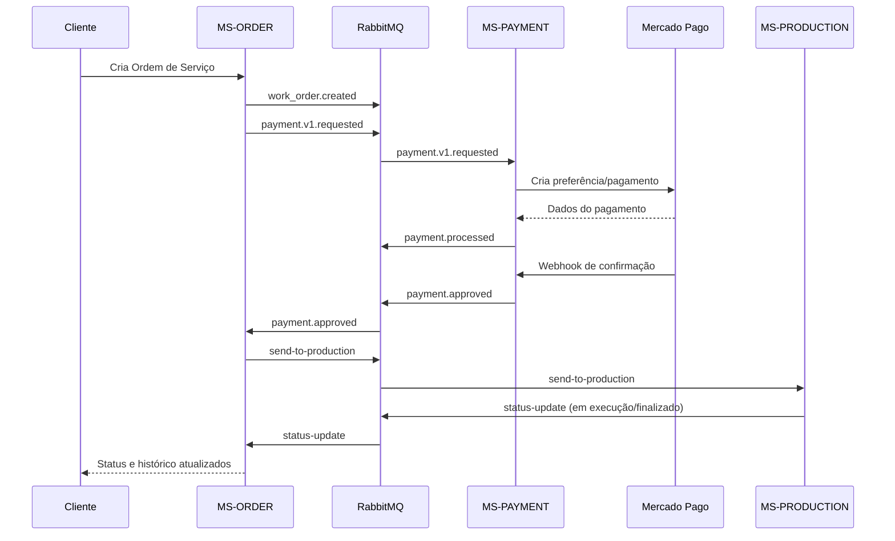

# Arquitetura - Fase 4 (Microsserviços + Saga)

**Projeto:** Tech Challenge - Fase 4 - SOAT12  
**Data:** Fevereiro de 2026  
**Versão:** 1.0

---

## Índice

1. [Visão geral](#visão-geral)
2. [Serviços e responsabilidades](#serviços-e-responsabilidades)
3. [Comunicação entre serviços](#comunicação-entre-serviços)
4. [Saga Pattern (coreografado)](#saga-pattern-coreografado)
5. [Fluxo ponta a ponta da OS](#fluxo-ponta-a-ponta-da-os)
6. [Falhas e compensação](#falhas-e-compensação)
7. [Deploy e operação](#deploy-e-operação)

---

## Visão geral

Na fase 4, a solução FullStack Motors evoluiu para arquitetura distribuída baseada em microsserviços, com comunicação assíncrona orientada a eventos e coordenação transacional usando Saga Pattern coreografado.

Objetivos atendidos nesta arquitetura:
- separar domínios de negócio em serviços independentes;
- reduzir acoplamento entre contextos de OS, pagamento e produção;
- permitir rollback lógico por compensação em falhas;
- sustentar deploy independente em Kubernetes.

---

## Serviços e responsabilidades

| Serviço | Papel no domínio | Persistência |
|---|---|---|
| **MS-ORDER** | Abertura da OS, histórico, status e avanço do fluxo de negócio | Banco relacional (PostgreSQL) |
| **MS-PAYMENT** | Criação/processamento de pagamento, integração Mercado Pago, confirmação de aprovação | Banco relacional (PostgreSQL) |
| **MS-PRODUCTION** | Entrada em produção, execução e atualização de progresso da OS | Banco do serviço + integração assíncrona |

Observação arquitetural:
- os serviços não compartilham acesso direto ao banco uns dos outros;
- integração ocorre por eventos e contratos de mensagem.

---

## Comunicação entre serviços

### Backbone de eventos

- RabbitMQ como camada de mensageria principal.
- Publicação de eventos por produtores de domínio.
- Consumo por handlers/estratégias específicas em cada microsserviço.

### Eventos de integração observados

- `work_order.created`
- `work_order.budget_generated`
- `work_order.awaiting_approval`
- `payment.v1.requested`
- `payment.processed`
- `payment.approved`
- `send-to-production`
- `status-update`
- `compensate`

---

## Saga Pattern (coreografado)

### Decisão arquitetural

Foi adotado o modelo **coreografado**, no qual cada serviço reage a eventos e publica novos eventos para continuidade do fluxo.

### Motivos da escolha

- mantém os serviços autônomos, sem um orquestrador central;
- facilita evolução independente dos domínios;
- combina com o uso de RabbitMQ já adotado no ecossistema;
- melhora resiliência em fluxos longos com múltiplas etapas.

---

## Fluxo ponta a ponta da OS

---

## Falhas e compensação

Quando ocorre falha em etapa crítica da transação distribuída, o fluxo publica evento de compensação para reversão lógica do processo.

Exemplos de compensação no ciclo:
- pagamento não aprovado dentro da regra de negócio;
- inconsistência ao avançar estado da OS;
- erro em integração externa.

A ação de compensação é propagada por evento (`compensate`) para restaurar consistência entre os serviços participantes da saga.

---

## Deploy e operação

- Cada microsserviço possui `Dockerfile` e manifestos próprios em `k8s/`.
- O deploy é desacoplado por serviço, permitindo evolução independente.
- Observabilidade reutiliza fundamentos já estabelecidos na fase 3.

---

**Documento elaborado por:** Equipe SOAT12  
**Última atualização:** Fevereiro de 2026
