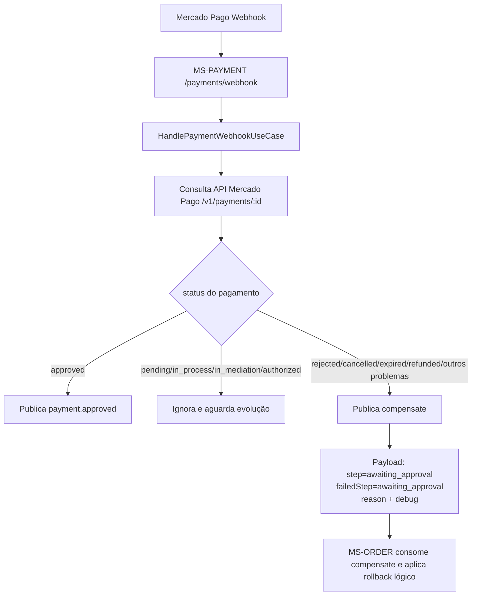

# Saga - Compensação de Pagamento (MS-PAYMENT)

Este documento descreve os cenários de compensação de saga adicionados no `MS-PAYMENT` para falhas relacionadas ao Mercado Pago.

## Cenários cobertos

### 1) Webhook de pagamento com falha/expiração/problema

Quando o webhook do Mercado Pago é processado e o pagamento **não está aprovado**:

- se o status ainda estiver em andamento (`pending`, `in_process`, `in_mediation`, `authorized`), o evento é apenas aguardado;
- se o status indicar problema de pagamento (ex.: `rejected`, `cancelled`, `expired`, `refunded`, etc.), o serviço publica um evento `compensate` na saga.

Payload de compensação publicado (resumo):

- `workOrderId`
- `step: "awaiting_approval"`
- `failedStep: "awaiting_approval"`
- `reason`
- `debug` com payload do Mercado Pago:
  - `debug.webhook` (payload recebido no webhook)
  - `debug.mercadoPago` (detalhes retornados pela API de pagamentos)

#### Diagrama (cenário 1)



### 2) Falha ao criar link de pagamento (checkout preference)

Quando a requisição para `POST /checkout/preferences` no Mercado Pago falha (erro HTTP ou erro de execução):

- se houver `workOrderId`, o serviço publica `compensate` na saga com o mesmo `step` de referência (`awaiting_approval`);
- o evento inclui `debug` com dados da tentativa de criação do link.

## Objetivo da compensação

Permitir rollback lógico da OS no `MS-ORDER` para evitar que a ordem permaneça presa em estado inconsistente quando a etapa de pagamento falha.

## Teste manual do webhook de falha (curl)

Simulação do webhook de pagamento para um payment id que, na consulta ao Mercado Pago, resulte em status de falha:

```bash
curl -X POST "http://localhost:3002/payments/webhook" \
  -H "Content-Type: application/json" \
  -d '{
    "type": "payment",
    "action": "payment.updated",
    "data": {
      "id": "123456789"
    }
  }'
```

> Observação: o status final (e consequente compensação) depende do que a API do Mercado Pago retornar para o `data.id` informado.
