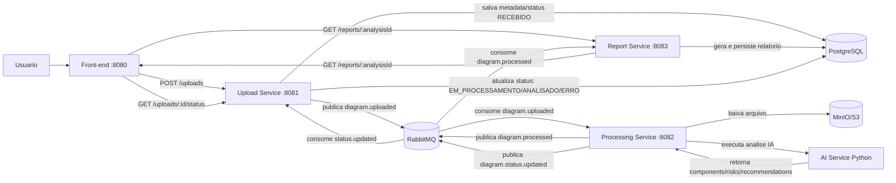

# Tech Challenge - Fase 5 - SOAT12

**Faculdade de Informática e Administração Paulista**  
**Pós-graduação Software Architecture**  
**FullStack Motors**

**Equipe:**
- Andrey Hurpia da Rocha - RM366440
- Rodrigo Tavares Franco Junior - RM366199
- Vinicius Marinheiro Rodrigues Silva - RM365289

**São Paulo, 2026**

## Hackathon Integrado - Análise Automatizada de Diagramas de Arquitetura

Este documento consolida a entrega da Fase 5, considerando:

- requisitos funcionais e técnicos definidos no enunciado;
- evolução arquitetural construída nas fases anteriores;
- implementação prática distribuída nos repositórios hackathon-soat*.

## 1. Objetivo da Solução

A solução implementa um fluxo ponta a ponta para receber diagramas de arquitetura (imagem ou PDF), processar o conteúdo com IA, classificar riscos e gerar relatório técnico estruturado, com acompanhamento de status durante o processamento.

Fluxo principal do MVP:

1. Upload do diagrama.
2. Criação da análise.
3. Processamento assíncrono e chamada da IA.
4. Geração de relatório técnico.
5. Consulta de status da análise.

## 2. Repositórios Oficiais do Projeto

### Repositórios principais (obrigatórios)

- Orquestrador e ambiente integrado: https://github.com/Rodrigojuniorj/hackathon-soat
- Front-end (BFF/UI): https://github.com/Rodrigojuniorj/hackathon-soat-front
- Serviço de IA: https://github.com/Rodrigojuniorj/hackathon-soat-ai-service
- Serviço de Processamento: https://github.com/Rodrigojuniorj/hackathon-soat-processing-service
- Serviço de Relatórios: https://github.com/Rodrigojuniorj/hackathon-soat-report-service
- Serviço de Upload: https://github.com/Rodrigojuniorj/hackathon-soat-upload-service

### Materiais de referência da disciplina

- Fase 3 (fundação arquitetural): ../fase-3/README.md
- Fase 4 (microsserviços + saga): ../fase-4/README.md
- Requisitos da Fase 5: ./REQUISITOS.md

## 3. Instalação e execução do projeto localmente

É necessário ter Docker instalado e em funcionamento.

```
git clone git@github.com:Rodrigojuniorj/hackathon-soat.git
git clone git@github.com:Rodrigojuniorj/hackathon-soat-ai-service.git
git clone git@github.com:Rodrigojuniorj/hackathon-soat-upload-service.git
git clone git@github.com:Rodrigojuniorj/hackathon-soat-report-service.git
git clone git@github.com:Rodrigojuniorj/hackathon-soat-processing-service.git
git clone git@github.com:Rodrigojuniorj/hackathon-soat-front.git

cd hackathon-soat
docker compose -f docker-compose.local.yml up --build
```

Acesse http://localhost:8080/

## 4. Visão Arquitetural da Fase 5
A solução foi organizada em microsserviços com comunicação síncrona e assíncrona:

- Comunicação síncrona: REST (upload e consulta de status/relatório).
- Comunicação assíncrona: RabbitMQ (eventos entre upload, processamento e relatório).

Serviços e responsabilidades:

- front-end:
  - interface web para envio de arquivo e acompanhamento do resultado;
  - integração com upload-service e report-service;
  - execução local na porta 8080.

- upload-service:
  - recebe arquivos (PNG/JPG/PDF);
  - persiste metadados da análise;
  - publica evento para processamento;
  - expõe endpoint de status.

- processing-service:
  - consome evento de upload;
  - executa pipeline de extração/preparação;
  - integra com ai-service (ou modo stub, conforme ambiente).

- ai-service:
  - realiza análise do diagrama com modelo de IA;
  - devolve componentes, riscos e recomendações em JSON estruturado;
  - publica resultado para geração de relatório.

- report-service:
  - consolida saída da IA;
  - persiste relatório técnico;
  - expõe endpoint de consulta por analysisId.

Infraestrutura observada:

- Docker e Docker Compose para execução local;
- manifestos Kubernetes por serviço (deploy em AKS);
- PostgreSQL, RabbitMQ e MinIO no ambiente integrado;
- pipelines CI/CD por repositório com build, testes e deploy.

## 5. Fluxo Funcional Atendido

### 5.1 Upload de diagrama

- Endpoint: POST /uploads
- Tipos aceitos: PNG, JPG, PDF
- Resultado: analysisId gerado + status inicial RECEBIDO

### 5.2 Status do processamento

- Endpoint: GET /uploads/:id/status
- Estados previstos no MVP:
  - RECEBIDO
  - EM_PROCESSAMENTO
  - ANALISADO
  - ERRO

### 5.3 Relatório técnico estruturado

- Endpoint: GET /reports/:analysisId
- Conteúdo esperado:
  - componentes identificados;
  - riscos arquiteturais;
  - recomendações;
  - resumo técnico.

### 5.4 Diagrama do fluxo da aplicação



## 6. Pipeline de IA (IADT)

Abordagem implementada no projeto:

- análise de diagramas (imagem e PDF) com LLM;
- prompt com estrutura de saída obrigatória em JSON;
- validação de formato e normalização de severidade/prioridade;
- integração ao fluxo distribuído via mensageria (não isolado).

Tratamento de falhas de IA no fluxo:

- publicação de status ERRO em caso de exceção;
- persistência de mensagem de erro para rastreabilidade;
- continuidade do controle transacional por status da análise.

## 7. Segurança

Medidas de segurança identificadas/planejadas na solução:

- validação de entrada nos serviços REST (DTO + validation pipes em NestJS);
- tratamento de falhas com status explícito e rastreável (ERRO);
- uso de mensageria para desacoplamento e resiliência operacional;
- segregação de responsabilidades por microsserviço;
- uso de variáveis de ambiente e segredos de cluster para configuração sensível;
- análise estruturada de riscos arquiteturais na camada de IA.

Riscos e limitações que exigem evolução (detalhados em TODO.md):

- endurecimento de guardrails e avaliação de qualidade da IA;
- revisão de exposição de segredos em pipeline;
- fortalecimento dos quality gates e cobertura de testes;
- evidência formal de isolamento de dados por serviço.

## 8. Como Executar

## 8.1 Ambiente integrado

No repositório orquestrador:

- Desenvolvimento:
  - docker compose -f docker-compose.local.yml up --build

- Execução padrão:
  - docker compose up --build

## 8.2 Endpoints úteis (ambiente local integrado)

- Front-end: http://localhost:8080
- Upload Service: http://localhost:8081
- Swagger Upload: http://localhost:8081/docs
- Report Service: http://localhost:8083
- Swagger Report: http://localhost:8083/docs
- RabbitMQ UI: http://localhost:15672
- MinIO Console: http://localhost:9001

## 9. Atendimentos e Aderência ao Enunciado

Resumo de aderência geral ao enunciado da Fase 5:

- Arquitetura em microsserviços: atendido.
- REST + fluxo assíncrono: atendido.
- Pipeline de IA integrado ao sistema: atendido.
- Geração de relatório técnico estruturado: atendido.
- Docker + Compose/K8s + CI/CD: atendido.
- Logs e tratamento de erros: atendido com evolução recomendada.
- Testes automatizados por serviço: parcialmente atendido (há gaps, ver TODO.md).
- Segurança e governança de IA: parcialmente atendido (há gaps, ver TODO.md).

## 10. Entregáveis da Fase 5

- Código-fonte distribuído nos repositórios hackathon-soat*.
- Dockerfiles e Docker Compose.
- Manifestos Kubernetes por serviço.
- Pipelines CI/CD por serviço.
- Documentação consolidada da fase (este README).
- Mapa de pendências priorizado: TODO.md.

## 11. Conclusão

A fase 5 foi implementada com fluxo funcional ponta a ponta para análise automática de diagramas, arquitetura distribuída e integração IA + sistema. Para elevar maturidade e robustez de produção, recomenda-se concluir os itens priorizados em TODO.md, com foco em segurança, qualidade de teste e governança da IA.
